# MauBaoCao — Mẫu Báo Cáo Đồ Án
<!-- LAYOUT TOÀN CỤC:
  - Khổ giấy: A4
  - Header (đầu trang, 2 cột): trái = "Xây dựng website nghe nhạc trực tuyến Melodify" | phải = "Tên GV Hướng dẫn"
  - Đường kẻ đôi (double rule) ngay dưới header, trải full width
  - Footer (cuối trang, 2 cột): trái = "Họ và tên SV thực hiện" | phải = số trang (La Mã: i, ii, iii... cho phần đầu; Ả Rập: 1, 2, 3... từ MỞ ĐẦU trở đi)
  - Đường kẻ đơn (single rule) ngay trên footer
  - Lề: khoảng 2–2.5 cm mỗi bên
  - Font chính: Times New Roman (suy từ kiểu chữ serif trong ảnh)
  - Các ghi chú màu đỏ trong file gốc là hướng dẫn của giảng viên (không in)
-->

---

<!-- ══════════════════════════════════════════
     TRANG i — NHẬN XÉT CỦA GIẢNG VIÊN HƯỚNG DẪN
     Đây là trang riêng (page break trước và sau)
     Toàn bộ nằm trong một khung viền đơn (box border) chiếm gần hết phần thân trang
     ══════════════════════════════════════════ -->

<!-- LAYOUT trang i:
  - Tiêu đề: căn giữa, chữ HOA, in đậm, cỡ ~14pt
  - Phần nội dung: ~37 dòng chấm (....) trải full width trong khung, dùng để viết tay
  - Dòng chấm đầu tiên có indent ~3 cm từ trái (dòng thứ nhất ngắn hơn)
  - Phần ký tên: căn phải, italic, gồm 3 dòng:
      Dòng 1: italic "…………, ngày ….. tháng …… năm ……"
      Dòng 2: bold "Giáo viên hướng dẫn"
      Dòng 3: italic "(Ký tên và ghi rõ họ tên)"
  - Số trang footer: i (La Mã)
-->

## NHẬN XÉT CỦA GIẢNG VIÊN HƯỚNG DẪN

<!-- Phần này gồm ~37 dòng chấm dành để viết nhận xét, ký hiệu bằng các dòng \dotfill trong LaTeX -->

\dotfill

\dotfill

\dotfill

\dotfill

\dotfill

\dotfill

\dotfill

\dotfill

\dotfill

\dotfill

\dotfill

\dotfill

\dotfill

\dotfill

\dotfill

\dotfill

\dotfill

\dotfill

\dotfill

\dotfill

\dotfill

\dotfill

\dotfill

\dotfill

\dotfill

\dotfill

\dotfill

\dotfill

\dotfill

\dotfill

\dotfill

\dotfill

\dotfill

\dotfill

\dotfill

\dotfill

\dotfill

<!-- Phần ký tên — căn phải -->
*…………, ngày ….. tháng …… năm ……*

**Giáo viên hướng dẫn**

*(Ký tên và ghi rõ họ tên)*

---

<!-- ══════════════════════════════════════════
     TRANG ii — NHẬN XÉT CỦA THÀNH VIÊN HỘI ĐỒNG
     Cấu trúc layout giống hệt trang i, chỉ khác tiêu đề và chức danh ký tên
     Số trang footer: ii (La Mã)
     ══════════════════════════════════════════ -->

## NHẬN XÉT CỦA THÀNH VIÊN HỘI ĐỒNG

<!-- ~37 dòng chấm, giống trang i -->

\dotfill

\dotfill

\dotfill

\dotfill

\dotfill

\dotfill

\dotfill

\dotfill

\dotfill

\dotfill

\dotfill

\dotfill

\dotfill

\dotfill

\dotfill

\dotfill

\dotfill

\dotfill

\dotfill

\dotfill

\dotfill

\dotfill

\dotfill

\dotfill

\dotfill

\dotfill

\dotfill

\dotfill

\dotfill

\dotfill

\dotfill

\dotfill

\dotfill

\dotfill

\dotfill

\dotfill

\dotfill

<!-- Phần ký tên — căn phải -->
*…………, ngày ….. tháng …… năm ……*

**Thành viên hội đồng**

*(Ký tên và ghi rõ họ tên)*

---

<!-- ══════════════════════════════════════════
     TRANG iii — LỜI CẢM ƠN
     - Tiêu đề: căn giữa, HOA, đậm
     - Nội dung: để trống (SV tự điền)
     - Số trang footer: iii (La Mã)
     ══════════════════════════════════════════ -->

## LỜI CẢM ƠN

<!-- Nội dung để trống, SV tự điền -->

---

<!-- ══════════════════════════════════════════
     TRANG iv — MỤC LỤC
     - Tiêu đề: căn giữa, HOA, đậm
     - Nội dung: ghi chú SV tạo tự động
     - Số trang footer: iv (La Mã)
     ══════════════════════════════════════════ -->

## MỤC LỤC

<!-- Ghi chú hướng dẫn — không in ra bản chính thức -->
*(SV tạo mục lục tự động)*

---

<!-- ══════════════════════════════════════════
     TRANG v — DANH MỤC HÌNH ẢNH
     - Tiêu đề: căn giữa, HOA, đậm
     - Nội dung: để trống, SV tự điền
     - Số trang footer: v (La Mã)
     ══════════════════════════════════════════ -->

## DANH MỤC HÌNH ẢNH

<!-- Nội dung để trống -->

---

<!-- ══════════════════════════════════════════
     TRANG vi — DANH MỤC BẢNG BIỂU
     - Tiêu đề: căn giữa, HOA, đậm
     - Nội dung: để trống, SV tự điền
     - Số trang footer: vi (La Mã)
     ══════════════════════════════════════════ -->

## DANH MỤC BẢNG BIỂU

<!-- Nội dung để trống -->

---

<!-- ══════════════════════════════════════════
     TRANG vii — TÓM TẮT ĐỒ ÁN
     - Tiêu đề: căn giữa, HOA, đậm
     - Đoạn ghi chú: căn justify, indent đầu dòng ~1.27 cm (1 tab)
     - Số trang footer: vii (La Mã)
     ══════════════════════════════════════════ -->

## TÓM TẮT ĐỒ ÁN

<!-- Đoạn mô tả: indent đầu dòng ~1.27 cm, căn justify -->

Đồ án "Xây dựng website nghe nhạc trực tuyến Melodify" nghiên cứu và phát triển một nền tảng web cho phép người dùng nghe nhạc trực tuyến, quản lý thư viện cá nhân, tạo danh sách phát, tìm kiếm bài hát và theo dõi nghệ sĩ yêu thích. Hệ thống được xây dựng trên nền tảng ASP.NET Core 9.0 theo mô hình kiến trúc MVC (Model – View – Controller), sử dụng Entity Framework Core kết hợp với cơ sở dữ liệu MySQL, hệ thống xác thực và phân quyền ASP.NET Identity, ánh xạ dữ liệu tự động thông qua AutoMapper. Giao diện người dùng được thiết kế hiện đại theo phong cách tối (dark mode) lấy cảm hứng từ Spotify, sử dụng TailwindCSS và Bootstrap 5. Hệ thống phân thành hai phân hệ chính: phân hệ người dùng cho phép nghe nhạc, quản lý playlist, thích bài hát, theo dõi nghệ sĩ; và phân hệ quản trị cho phép Admin quản lý toàn bộ dữ liệu bài hát, nghệ sĩ, album. Kết quả đạt được là một ứng dụng web nghe nhạc hoàn chỉnh với đầy đủ tính năng cơ bản, giao diện thân thiện, hoạt động ổn định.

---

<!-- ══════════════════════════════════════════
     TRANG 1 — MỞ ĐẦU
     BẮT ĐẦU đánh số trang Ả Rập từ đây (trang 1)
     - Tiêu đề "MỞ ĐẦU": căn giữa, HOA, đậm
     - Dòng ghi chú đầu: căn justify, không indent, chữ thường, ngoặc đơn
     - Các mục số (1. 2. 3. 4.): in đậm, không indent, cỡ 13pt (Heading 2 style)
     - Nội dung "…": bình thường, căn trái
     ══════════════════════════════════════════ -->

## MỞ ĐẦU

**1. Lý do chọn đề tài**

Trong bối cảnh công nghệ thông tin phát triển mạnh mẽ và nhu cầu giải trí trực tuyến ngày càng gia tăng, nghe nhạc trực tuyến đã trở thành một phần không thể thiếu trong cuộc sống hàng ngày của hàng triệu người dùng trên toàn thế giới. Các nền tảng nghe nhạc phổ biến như Spotify, Apple Music, YouTube Music đã chứng minh tiềm năng to lớn của thị trường này. Tại Việt Nam, nhu cầu nghe nhạc trực tuyến cũng không ngừng tăng trưởng, đặc biệt trong giới trẻ.

Tuy nhiên, việc xây dựng một hệ thống nghe nhạc trực tuyến hoàn chỉnh đòi hỏi sự kết hợp nhiều kiến thức chuyên môn: từ thiết kế cơ sở dữ liệu quan hệ, xây dựng kiến trúc phần mềm theo mô hình MVC, xử lý xác thực và phân quyền người dùng, quản lý file media, đến thiết kế giao diện người dùng hiện đại và responsive. Đây là cơ hội tốt để áp dụng và tổng hợp các kiến thức đã học trong quá trình đào tạo.

Xuất phát từ những lý do trên, đề tài "Xây dựng website nghe nhạc trực tuyến Melodify" được lựa chọn nhằm nghiên cứu và phát triển một nền tảng nghe nhạc web hoàn chỉnh, phục vụ nhu cầu thực tế của người dùng.

**2. Mục tiêu nghiên cứu**

- Phân tích, thiết kế và xây dựng hệ thống website nghe nhạc trực tuyến hoàn chỉnh với đầy đủ các chức năng cơ bản: đăng ký, đăng nhập, nghe nhạc, tìm kiếm, quản lý thư viện cá nhân, tạo danh sách phát, thích bài hát, theo dõi nghệ sĩ.
- Xây dựng trang quản trị (Admin Panel) cho phép quản trị viên quản lý toàn bộ nội dung hệ thống bao gồm: bài hát, nghệ sĩ, album.
- Áp dụng mô hình kiến trúc MVC và các nguyên tắc thiết kế phần mềm (SOLID, Repository Pattern, Service Layer) để xây dựng hệ thống có cấu trúc rõ ràng, dễ bảo trì và mở rộng.
- Thiết kế giao diện người dùng hiện đại, thân thiện, responsive theo phong cách dark mode lấy cảm hứng từ các nền tảng nghe nhạc hàng đầu.

**3. Đối tượng và phạm vi nghiên cứu**

*Đối tượng nghiên cứu:*
- Hệ thống website nghe nhạc trực tuyến.
- Công nghệ ASP.NET Core MVC, Entity Framework Core, ASP.NET Identity.
- Cơ sở dữ liệu quan hệ MySQL.
- Thư viện giao diện TailwindCSS, Bootstrap 5, JavaScript.

*Phạm vi nghiên cứu:*
- Xây dựng phân hệ người dùng: nghe nhạc, tìm kiếm, quản lý thư viện, playlist, yêu thích bài hát, theo dõi nghệ sĩ.
- Xây dựng phân hệ quản trị: quản lý CRUD bài hát, nghệ sĩ, album với phân trang, tìm kiếm, sắp xếp, tải lên file âm thanh và ảnh bìa.
- Hệ thống xác thực và phân quyền người dùng (User/Admin).
- Trình phát nhạc tích hợp trên giao diện web.

**4. Phương pháp nghiên cứu**

- Phương pháp phân tích và thiết kế hướng đối tượng (OOP) để mô hình hóa hệ thống.
- Sử dụng lược đồ Use Case để phân tích yêu cầu chức năng từ góc nhìn người dùng.
- Áp dụng mô hình kiến trúc MVC (Model – View – Controller) để phân tách rõ ràng các tầng xử lý.
- Áp dụng Repository Pattern và Service Layer Pattern để tổ chức logic nghiệp vụ.
- Thiết kế cơ sở dữ liệu quan hệ và sử dụng Entity Framework Core (Code-First) để quản lý.
- Phương pháp thực nghiệm: cài đặt, chạy thử và kiểm thử hệ thống trên môi trường phát triển.

---

<!-- ══════════════════════════════════════════
     TRANG 2 — CHƯƠNG 1: NGHIÊN CỨU LÝ THUYẾT
     - Tiêu đề: căn giữa, HOA, đậm, cỡ lớn (~14–16pt) — Heading 1 style
     - Các mục 1.1, 1.2, 1.3...: đậm, không indent
     - Các mục con 1.1.1, 1.1.2...: đậm, indent ~0.63 cm
     ══════════════════════════════════════════ -->

# CHƯƠNG 1: NGHIÊN CỨU LÝ THUYẾT

<!-- Đoạn mô tả: indent đầu dòng ~1.27 cm, căn justify -->
Trình bày cơ sở lý thuyết, lý luận, giả thiết khoa học và phương pháp nghiên cứu đã được sử dụng trong đồ án.

## 1.1 Tổng quan về ASP.NET Core MVC

### 1.1.1 Giới thiệu ASP.NET Core

ASP.NET Core là một framework mã nguồn mở, đa nền tảng do Microsoft phát triển, dùng để xây dựng các ứng dụng web hiện đại, hiệu năng cao. ASP.NET Core 9.0 là phiên bản mới nhất được sử dụng trong đồ án này, cung cấp nhiều cải tiến về hiệu suất, bảo mật và khả năng mở rộng.

Đặc điểm nổi bật của ASP.NET Core:
- Đa nền tảng: chạy được trên Windows, Linux, macOS.
- Hiệu năng cao: là một trong những framework web nhanh nhất hiện nay.
- Dependency Injection (DI) tích hợp sẵn: hỗ trợ nguyên tắc Inversion of Control.
- Mô hình middleware pipeline linh hoạt cho việc xử lý HTTP request/response.
- Hỗ trợ đầy đủ cho các mô hình phát triển web: MVC, Razor Pages, Web API, Blazor.

### 1.1.2 Mô hình MVC (Model – View – Controller)

MVC là một mẫu kiến trúc phần mềm chia ứng dụng thành ba thành phần chính:

- **Model**: Đại diện cho dữ liệu và logic nghiệp vụ. Trong đồ án, Model bao gồm các Entity class (User, Artist, Album, Track, Playlist, LikedTrack, FollowArtist, PlaylistTrack) và các DTO class (Data Transfer Object) dùng để truyền dữ liệu giữa các tầng.
- **View**: Chịu trách nhiệm hiển thị giao diện người dùng. Sử dụng Razor View Engine (.cshtml) kết hợp với HTML, CSS (TailwindCSS, Bootstrap), JavaScript.
- **Controller**: Tiếp nhận request từ người dùng, xử lý logic điều hướng, gọi Service Layer và trả về View tương ứng. Hệ thống có 7 Controller cho phân hệ người dùng và 3 Controller cho phân hệ quản trị.

### 1.1.3 Dependency Injection trong ASP.NET Core

Dependency Injection (DI) là một kỹ thuật thiết kế phần mềm cho phép đảo ngược sự phụ thuộc giữa các thành phần. ASP.NET Core cung cấp DI container tích hợp sẵn, cho phép đăng ký và tiêm các dịch vụ vào các Controller thông qua constructor injection. Trong đồ án, tất cả các Repository và Service đều được đăng ký dưới dạng Scoped service trong `Program.cs`:

- `ITrackRepository` → `TrackRepository`
- `IArtistRepository` → `ArtistRepository`
- `IAlbumRepository` → `AlbumRepository`
- `IPlaylistRepository` → `PlaylistRepository`
- `IFileService` → `FileService`
- `ITrackService` → `TrackService`
- `IArtistService` → `ArtistService`
- `IAlbumService` → `AlbumService`
- `IPlaylistService` → `PlaylistService`
- `ILikeService` → `LikeService`

## 1.2 Entity Framework Core và Code-First Approach

### 1.2.1 Giới thiệu Entity Framework Core

Entity Framework Core (EF Core) là một ORM (Object-Relational Mapping) framework mã nguồn mở cho .NET, cho phép lập trình viên tương tác với cơ sở dữ liệu thông qua các đối tượng C# thay vì viết câu lệnh SQL trực tiếp. EF Core hỗ trợ nhiều hệ quản trị cơ sở dữ liệu khác nhau thông qua các Database Provider.

Trong đồ án sử dụng:
- **Pomelo.EntityFrameworkCore.MySql** (phiên bản 9.0.0): Provider cho phép EF Core kết nối và tương tác với MySQL/MariaDB.
- **Microsoft.EntityFrameworkCore.Tools** (phiên bản 9.0.0): Công cụ hỗ trợ Migration, scaffolding.

### 1.2.2 Code-First Approach

Code-First là phương pháp tiếp cận trong đó lập trình viên định nghĩa các Entity class (mô hình dữ liệu) bằng C# trước, sau đó EF Core sẽ tự động tạo và cập nhật schema cơ sở dữ liệu tương ứng thông qua Migration. Phương pháp này cho phép kiểm soát hoàn toàn cấu trúc dữ liệu từ code, dễ dàng version control và đồng bộ giữa các môi trường phát triển.

Trong đồ án, `AppDbContext` kế thừa từ `IdentityDbContext<User>` và định nghĩa các `DbSet` tương ứng với các bảng trong cơ sở dữ liệu. Các quan hệ giữa các bảng được cấu hình trong phương thức `OnModelCreating` thông qua Fluent API.

## 1.3 ASP.NET Identity và Hệ thống phân quyền

### 1.3.1 Giới thiệu ASP.NET Identity

ASP.NET Identity là một hệ thống quản lý danh tính và xác thực (authentication/authorization) tích hợp sẵn trong ASP.NET Core. Hệ thống cung cấp các tính năng:

- Quản lý tài khoản người dùng (đăng ký, đăng nhập, đăng xuất).
- Quản lý vai trò (Role) và phân quyền.
- Hash mật khẩu an toàn.
- Cookie-based authentication.
- Xác thực hai yếu tố (Two-Factor Authentication).

### 1.3.2 Phân quyền trong hệ thống

Hệ thống Melodify sử dụng Role-based Authorization với hai vai trò:
- **Admin**: Có quyền truy cập trang quản trị (Admin Panel), quản lý CRUD toàn bộ bài hát, nghệ sĩ, album.
- **User**: Có quyền sử dụng các chức năng người dùng cuối (nghe nhạc, tạo playlist, thích bài hát, theo dõi nghệ sĩ, tìm kiếm).

Phân quyền được thực hiện thông qua attribute `[Authorize]` trên Controller và `[Authorize(Roles = "Admin")]` cho các Controller trong Area Admin.

## 1.4 AutoMapper

AutoMapper là một thư viện Object-to-Object Mapping cho .NET, giúp tự động ánh xạ dữ liệu giữa các đối tượng có cấu trúc tương tự nhau. Trong đồ án, AutoMapper được sử dụng để chuyển đổi giữa Entity class và DTO class:

- `Track` → `TrackDto` (kèm ánh xạ tên nghệ sĩ, tên album)
- `Artist` → `ArtistDto` (kèm trạng thái theo dõi)
- `Album` → `AlbumDto` (kèm tên nghệ sĩ, danh sách bài hát)
- `Playlist` → `PlaylistDto` (kèm tên người dùng, danh sách bài hát)

## 1.5 Các Design Pattern được áp dụng

### 1.5.1 Repository Pattern

Repository Pattern tạo một lớp trừu tượng giữa tầng truy xuất dữ liệu (Data Access Layer) và tầng logic nghiệp vụ (Business Logic Layer). Mỗi Entity có một Repository riêng với Interface tương ứng:

| Repository | Chức năng |
|---|---|
| `ITrackRepository` / `TrackRepository` | Truy xuất, thêm, sửa, xóa dữ liệu bài hát |
| `IArtistRepository` / `ArtistRepository` | Truy xuất, thêm, sửa, xóa dữ liệu nghệ sĩ |
| `IAlbumRepository` / `AlbumRepository` | Truy xuất, thêm, sửa, xóa dữ liệu album |
| `IPlaylistRepository` / `PlaylistRepository` | Truy xuất, thêm, sửa, xóa dữ liệu playlist |

### 1.5.2 Service Layer Pattern

Service Layer Pattern tách biệt logic nghiệp vụ khỏi Controller, giúp Controller chỉ đảm nhiệm vai trò điều hướng. Mỗi nghiệp vụ có một Service riêng:

| Service | Chức năng |
|---|---|
| `ITrackService` / `TrackService` | Xử lý logic nghiệp vụ liên quan đến bài hát |
| `IArtistService` / `ArtistService` | Xử lý logic nghiệp vụ liên quan đến nghệ sĩ |
| `IAlbumService` / `AlbumService` | Xử lý logic nghiệp vụ liên quan đến album |
| `IPlaylistService` / `PlaylistService` | Xử lý logic nghiệp vụ liên quan đến playlist |
| `ILikeService` / `LikeService` | Xử lý logic nghiệp vụ liên quan đến yêu thích bài hát |
| `IFileService` / `FileService` | Xử lý tải lên và xóa file media |

## 1.6 Công nghệ giao diện

### 1.6.1 TailwindCSS

TailwindCSS là một CSS framework dạng utility-first, cho phép xây dựng giao diện nhanh chóng bằng cách sử dụng các class tiện ích trực tiếp trong HTML. Hệ thống Melodify sử dụng TailwindCSS thông qua CDN với cấu hình tùy chỉnh bao gồm bảng màu riêng (dark mode), font chữ Plus Jakarta Sans.

### 1.6.2 Bootstrap 5

Bootstrap 5 được sử dụng bổ trợ cho một số thành phần UI như Modal (tạo playlist), Form controls (trong trang quản trị), và hệ thống Grid responsive.

### 1.6.3 Bootstrap Icons

Bootstrap Icons cung cấp bộ icon SVG miễn phí, được sử dụng xuyên suốt giao diện hệ thống cho các nút chức năng, menu điều hướng, và trình phát nhạc.

---

<!-- ══════════════════════════════════════════
     TRANG 3 — CHƯƠNG 2: HIỆN THỰC HÓA NGHIÊN CỨU
     - Tiêu đề: căn giữa, HOA, đậm — Heading 1
     - Đoạn mô tả dài: indent đầu dòng ~1.27 cm, căn justify
     - Các mục 2.1 – 2.5: không indent, đậm
     ══════════════════════════════════════════ -->

# CHƯƠNG 2: HIỆN THỰC HÓA NGHIÊN CỨU

<!-- Đoạn mô tả dài, indent đầu dòng ~1.27 cm, căn justify -->
Chương này trình bày chi tiết các bước phân tích, thiết kế và cài đặt hệ thống website nghe nhạc trực tuyến Melodify, bao gồm: mô tả bài toán, phân tích yêu cầu chức năng, thiết kế cơ sở dữ liệu, lược đồ Use Case, và kiến trúc tổng thể của hệ thống.

## 2.1 Mô tả bài toán

Hệ thống Melodify là một website nghe nhạc trực tuyến phục vụ hai nhóm người dùng chính:

**Người dùng cuối (User):** Có thể đăng ký tài khoản, đăng nhập vào hệ thống để nghe nhạc trực tuyến, duyệt xem trang chủ với các bài hát nổi bật, album mới phát hành, nghệ sĩ được gợi ý. Người dùng có thể tìm kiếm bài hát theo tên, tạo và quản lý danh sách phát cá nhân, đánh dấu yêu thích bài hát, theo dõi nghệ sĩ, xem chi tiết trang nghệ sĩ (bài hát phổ biến, danh sách album) và xem chi tiết album (danh sách bài hát trong album).

**Quản trị viên (Admin):** Ngoài các chức năng của người dùng thông thường, Admin có quyền truy cập trang quản trị để quản lý toàn bộ nội dung hệ thống. Admin có thể thêm mới, chỉnh sửa, xóa bài hát (bao gồm tải lên file âm thanh MP3 và ảnh bìa), quản lý thông tin nghệ sĩ (tên, ảnh đại diện, tiểu sử), quản lý album (tên, ảnh bìa, năm phát hành, nghệ sĩ sở hữu). Trang quản trị hỗ trợ phân trang, tìm kiếm, lọc và sắp xếp dữ liệu.

Sơ đồ tổng quan nghiệp vụ hệ thống:

```plantuml
@startuml
skinparam actorStyle awesome
skinparam backgroundColor #FEFEFE
skinparam shadowing false
skinparam defaultFontName "Arial"
skinparam defaultFontSize 12

title Sơ đồ tổng quan nghiệp vụ hệ thống Melodify

actor "Khách\n(Chưa đăng nhập)" as Guest
actor "Người dùng\n(Đã đăng nhập)" as User
actor "Quản trị viên" as Admin

rectangle "Hệ thống Melodify" {
  rectangle "Phân hệ xác thực" {
    usecase "Đăng ký tài khoản" as UC_Register
    usecase "Đăng nhập" as UC_Login
    usecase "Đăng xuất" as UC_Logout
  }

  rectangle "Phân hệ người dùng" {
    usecase "Xem trang chủ" as UC_Home
    usecase "Nghe nhạc" as UC_Play
    usecase "Tìm kiếm bài hát" as UC_Search
    usecase "Xem thư viện cá nhân" as UC_Library
    usecase "Tạo danh sách phát" as UC_CreatePlaylist
    usecase "Thêm bài hát vào\ndanh sách phát" as UC_AddToPlaylist
    usecase "Xóa bài hát khỏi\ndanh sách phát" as UC_RemoveFromPlaylist
    usecase "Xóa danh sách phát" as UC_DeletePlaylist
    usecase "Yêu thích bài hát" as UC_Like
    usecase "Bỏ yêu thích bài hát" as UC_Unlike
    usecase "Theo dõi nghệ sĩ" as UC_Follow
    usecase "Bỏ theo dõi nghệ sĩ" as UC_Unfollow
    usecase "Xem chi tiết nghệ sĩ" as UC_ArtistDetail
    usecase "Xem chi tiết album" as UC_AlbumDetail
    usecase "Xem chi tiết\ndanh sách phát" as UC_PlaylistDetail
  }

  rectangle "Phân hệ quản trị" {
    usecase "Quản lý bài hát" as UC_ManageTracks
    usecase "Tải lên bài hát mới" as UC_UploadTrack
    usecase "Chỉnh sửa bài hát" as UC_EditTrack
    usecase "Xóa bài hát" as UC_DeleteTrack
    usecase "Quản lý nghệ sĩ" as UC_ManageArtists
    usecase "Thêm nghệ sĩ mới" as UC_CreateArtist
    usecase "Chỉnh sửa nghệ sĩ" as UC_EditArtist
    usecase "Xóa nghệ sĩ" as UC_DeleteArtist
    usecase "Quản lý album" as UC_ManageAlbums
    usecase "Thêm album mới" as UC_CreateAlbum
    usecase "Chỉnh sửa album" as UC_EditAlbum
    usecase "Xóa album" as UC_DeleteAlbum
  }
}

Guest --> UC_Register
Guest --> UC_Login

User --> UC_Login
User --> UC_Logout
User --> UC_Home
User --> UC_Play
User --> UC_Search
User --> UC_Library
User --> UC_CreatePlaylist
User --> UC_AddToPlaylist
User --> UC_RemoveFromPlaylist
User --> UC_DeletePlaylist
User --> UC_Like
User --> UC_Unlike
User --> UC_Follow
User --> UC_Unfollow
User --> UC_ArtistDetail
User --> UC_AlbumDetail
User --> UC_PlaylistDetail

Admin --|> User

Admin --> UC_ManageTracks
Admin --> UC_ManageArtists
Admin --> UC_ManageAlbums

UC_ManageTracks ..> UC_UploadTrack : <<include>>
UC_ManageTracks ..> UC_EditTrack : <<include>>
UC_ManageTracks ..> UC_DeleteTrack : <<include>>

UC_ManageArtists ..> UC_CreateArtist : <<include>>
UC_ManageArtists ..> UC_EditArtist : <<include>>
UC_ManageArtists ..> UC_DeleteArtist : <<include>>

UC_ManageAlbums ..> UC_CreateAlbum : <<include>>
UC_ManageAlbums ..> UC_EditAlbum : <<include>>
UC_ManageAlbums ..> UC_DeleteAlbum : <<include>>

@enduml
```

## 2.2 Yêu cầu chức năng

### 2.2.1 Yêu cầu chức năng phân hệ người dùng

| STT | Chức năng | Mô tả chi tiết |
|-----|-----------|-----------------|
| 1 | Đăng ký tài khoản | Người dùng nhập họ tên, email, mật khẩu (tối thiểu 6 ký tự) và xác nhận mật khẩu để tạo tài khoản mới. Hệ thống kiểm tra tính hợp lệ của email, độ dài mật khẩu, và sự trùng khớp xác nhận mật khẩu. Sau khi đăng ký thành công, người dùng được tự động gán vai trò "User" và đăng nhập vào hệ thống. |
| 2 | Đăng nhập | Người dùng nhập email và mật khẩu để truy cập hệ thống. Hỗ trợ tùy chọn "Ghi nhớ đăng nhập" (Remember Me). Nếu đã đăng nhập, truy cập trang Login sẽ tự động chuyển hướng về trang chủ. |
| 3 | Đăng xuất | Người dùng bấm nút "Đăng xuất" trên thanh header để kết thúc phiên làm việc, hệ thống xóa cookie xác thực và chuyển hướng về trang đăng nhập. |
| 4 | Xem trang chủ | Hiển thị lời chào theo thời gian trong ngày kèm tên người dùng (ví dụ: "Chào buổi sáng, Minh Khôi"), danh sách 6 album mới phát hành, 5 bài hát nổi bật, 5 nghệ sĩ được gợi ý, và 5 playlist của người dùng. |
| 5 | Nghe nhạc | Người dùng bấm vào bài hát để phát nhạc trên trình phát tích hợp ở cuối trang. Trình phát hiển thị thông tin bài hát (tên, nghệ sĩ, ảnh bìa), thanh tiến trình, nút điều khiển (phát/tạm dừng, bài trước, bài tiếp, lặp lại, trộn bài), thanh điều chỉnh âm lượng. Mỗi lần phát sẽ tăng lượt nghe của bài hát. |
| 6 | Tìm kiếm bài hát | Người dùng nhập từ khóa vào ô tìm kiếm, hệ thống tìm kiếm bài hát theo tên bài hát hoặc tên nghệ sĩ, kết quả hiển thị với phân trang (20 bài/trang). |
| 7 | Xem thư viện cá nhân | Hiển thị hai tab: "Danh sách phát" (liệt kê tất cả playlist của người dùng) và "Bài hát đã thích" (liệt kê tất cả bài hát người dùng đã đánh dấu yêu thích). |
| 8 | Tạo danh sách phát | Người dùng bấm nút tạo mới, nhập tên danh sách phát trong hộp thoại (modal), hệ thống tạo playlist mới gắn với tài khoản người dùng hiện tại. |
| 9 | Thêm bài hát vào danh sách phát | Tại bất kỳ trang nào hiển thị bài hát, người dùng có thể chọn thêm bài hát vào một trong các playlist đã tạo. |
| 10 | Xóa bài hát khỏi danh sách phát | Trong trang chi tiết playlist, người dùng có thể xóa bài hát ra khỏi danh sách phát. Chỉ chủ sở hữu playlist mới có quyền thực hiện. |
| 11 | Xóa danh sách phát | Người dùng có thể xóa toàn bộ playlist. Chỉ chủ sở hữu playlist mới có quyền thực hiện. |
| 12 | Yêu thích / Bỏ yêu thích bài hát | Người dùng bấm nút trái tim để đánh dấu hoặc bỏ đánh dấu yêu thích bài hát. Trạng thái yêu thích được hiển thị trên tất cả các trang có bài hát. |
| 13 | Theo dõi / Bỏ theo dõi nghệ sĩ | Trong trang chi tiết nghệ sĩ, người dùng có thể bấm nút theo dõi hoặc bỏ theo dõi. |
| 14 | Xem chi tiết nghệ sĩ | Hiển thị thông tin nghệ sĩ (tên, ảnh, tiểu sử, lượt nghe hàng tháng), 5 bài hát phổ biến nhất, danh sách album, nút theo dõi/bỏ theo dõi. |
| 15 | Xem chi tiết album | Hiển thị thông tin album (tên, ảnh bìa, nghệ sĩ, năm phát hành), danh sách tất cả bài hát trong album. |
| 16 | Xem chi tiết danh sách phát | Hiển thị tên playlist, danh sách bài hát đã thêm, cho phép xóa bài hát hoặc xóa toàn bộ playlist. |

### 2.2.2 Yêu cầu chức năng phân hệ quản trị

| STT | Chức năng | Mô tả chi tiết |
|-----|-----------|-----------------|
| 1 | Quản lý bài hát | Xem danh sách bài hát với phân trang (10 bài/trang), tìm kiếm theo tên, lọc theo nghệ sĩ, sắp xếp theo lượt nghe (tăng/giảm) hoặc theo tên (A-Z/Z-A). |
| 2 | Tải lên bài hát mới | Nhập thông tin bài hát (tên, nghệ sĩ, album, thể loại), tải lên file âm thanh MP3 (tối đa 50MB), tải lên ảnh bìa (JPG/JPEG/PNG/WEBP, tối đa 5MB). |
| 3 | Chỉnh sửa bài hát | Chỉnh sửa thông tin bài hát (tên, nghệ sĩ, album, thể loại), có thể thay thế file âm thanh và ảnh bìa mới, file cũ sẽ tự động bị xóa. |
| 4 | Xóa bài hát | Xóa bài hát khỏi hệ thống, đồng thời xóa file âm thanh và ảnh bìa liên quan trên máy chủ. |
| 5 | Quản lý nghệ sĩ | Xem danh sách nghệ sĩ với phân trang (10 nghệ sĩ/trang), tìm kiếm theo tên. |
| 6 | Thêm nghệ sĩ mới | Nhập thông tin nghệ sĩ (tên, tiểu sử), tải lên ảnh đại diện (JPG/JPEG/PNG/WEBP, tối đa 5MB). |
| 7 | Chỉnh sửa nghệ sĩ | Chỉnh sửa thông tin nghệ sĩ (tên, tiểu sử), có thể thay thế ảnh đại diện mới. |
| 8 | Xóa nghệ sĩ | Xóa nghệ sĩ khỏi hệ thống, đồng thời xóa ảnh đại diện và cascade xóa tất cả bài hát, album liên quan. |
| 9 | Quản lý album | Xem danh sách album với phân trang (10 album/trang), tìm kiếm theo tên. |
| 10 | Thêm album mới | Nhập thông tin album (tên, nghệ sĩ, năm phát hành), tải lên ảnh bìa. |
| 11 | Chỉnh sửa album | Chỉnh sửa thông tin album (tên, nghệ sĩ, năm phát hành), có thể thay thế ảnh bìa mới. |
| 12 | Xóa album | Xóa album khỏi hệ thống, đồng thời xóa ảnh bìa và cascade xóa tất cả bài hát thuộc album. |

## 2.3 Mô hình cơ sở dữ liệu

### 2.3.1 Sơ đồ cơ sở dữ liệu

Hệ thống sử dụng cơ sở dữ liệu MySQL với 8 bảng dữ liệu chính (không tính các bảng hệ thống của ASP.NET Identity). Dưới đây là sơ đồ quan hệ giữa các bảng:

```dbdiagram
Table AspNetUsers {
  Id varchar(128) [pk]
  FullName longtext
  CreatedAt datetime
  UserName varchar(256)
  NormalizedUserName varchar(128)
  Email varchar(256)
  NormalizedEmail varchar(128)
  EmailConfirmed tinyint(1)
  PasswordHash longtext
  SecurityStamp longtext
  ConcurrencyStamp longtext
  PhoneNumber longtext
  PhoneNumberConfirmed tinyint(1)
  TwoFactorEnabled tinyint(1)
  LockoutEnd datetime
  LockoutEnabled tinyint(1)
  AccessFailedCount int
}

Table Artists {
  ArtistId int [pk, increment]
  Name longtext [not null]
  ImageUrl longtext
  MonthlyListeners int [not null]
  Bio longtext
}

Table Albums {
  AlbumId int [pk, increment]
  Title longtext [not null]
  ArtistId int [not null, ref: > Artists.ArtistId]
  CoverImage longtext
  ReleaseYear int [not null]
}

Table Tracks {
  TrackId int [pk, increment]
  Title longtext [not null]
  ArtistId int [not null, ref: > Artists.ArtistId]
  AlbumId int [ref: > Albums.AlbumId]
  Genre longtext
  Duration int [not null]
  AudioUrl longtext [not null]
  CoverImage longtext
  PlayCount int [not null, default: 0]
}

Table Playlists {
  PlaylistId int [pk, increment]
  UserId varchar(128) [not null, ref: > AspNetUsers.Id]
  Name longtext [not null]
  CreatedAt datetime [not null]
}

Table PlaylistTracks {
  PlaylistId int [pk, ref: > Playlists.PlaylistId]
  TrackId int [pk, ref: > Tracks.TrackId]
}

Table LikedTracks {
  UserId varchar(128) [pk, ref: > AspNetUsers.Id]
  TrackId int [pk, ref: > Tracks.TrackId]
  LikedAt datetime [not null]
}

Table FollowedArtists {
  UserId varchar(128) [pk, ref: > AspNetUsers.Id]
  ArtistId int [pk, ref: > Artists.ArtistId]
  FollowedAt datetime [not null]
}
```

### 2.3.2 Mô tả chi tiết các bảng

**Bảng AspNetUsers (Người dùng)**

Bảng này kế thừa từ ASP.NET Identity, lưu trữ thông tin tài khoản người dùng. Ngoài các trường mặc định của Identity (UserName, Email, PasswordHash, SecurityStamp...), bảng được mở rộng thêm hai trường:

| Tên cột | Kiểu dữ liệu | Mô tả |
|---------|---------------|-------|
| Id | varchar(128) | Khóa chính, ID duy nhất của người dùng (GUID) |
| FullName | longtext | Họ và tên đầy đủ của người dùng |
| CreatedAt | datetime | Thời điểm tạo tài khoản |
| Email | varchar(256) | Địa chỉ email (dùng làm tên đăng nhập) |
| PasswordHash | longtext | Mật khẩu đã được mã hóa (hash) |

**Bảng Artists (Nghệ sĩ)**

Lưu trữ thông tin các nghệ sĩ/ca sĩ trong hệ thống.

| Tên cột | Kiểu dữ liệu | Ràng buộc | Mô tả |
|---------|---------------|-----------|-------|
| ArtistId | int | PK, Auto Increment | Mã nghệ sĩ |
| Name | longtext | NOT NULL | Tên nghệ sĩ |
| ImageUrl | longtext | Nullable | Đường dẫn ảnh đại diện |
| MonthlyListeners | int | NOT NULL | Số lượt nghe hàng tháng |
| Bio | longtext | Nullable | Tiểu sử nghệ sĩ |

**Bảng Albums (Album)**

Lưu trữ thông tin các album nhạc, mỗi album thuộc về một nghệ sĩ.

| Tên cột | Kiểu dữ liệu | Ràng buộc | Mô tả |
|---------|---------------|-----------|-------|
| AlbumId | int | PK, Auto Increment | Mã album |
| Title | longtext | NOT NULL | Tên album |
| ArtistId | int | FK → Artists.ArtistId, NOT NULL | Mã nghệ sĩ sở hữu album |
| CoverImage | longtext | Nullable | Đường dẫn ảnh bìa |
| ReleaseYear | int | NOT NULL | Năm phát hành |

**Bảng Tracks (Bài hát)**

Lưu trữ thông tin các bài hát, mỗi bài hát thuộc về một nghệ sĩ và có thể thuộc một album.

| Tên cột | Kiểu dữ liệu | Ràng buộc | Mô tả |
|---------|---------------|-----------|-------|
| TrackId | int | PK, Auto Increment | Mã bài hát |
| Title | longtext | NOT NULL | Tên bài hát |
| ArtistId | int | FK → Artists.ArtistId, NOT NULL | Mã nghệ sĩ thể hiện |
| AlbumId | int | FK → Albums.AlbumId, Nullable | Mã album (có thể không thuộc album nào) |
| Genre | longtext | Nullable | Thể loại nhạc |
| Duration | int | NOT NULL | Thời lượng (giây) |
| AudioUrl | longtext | NOT NULL | Đường dẫn file âm thanh MP3 |
| CoverImage | longtext | Nullable | Đường dẫn ảnh bìa bài hát |
| PlayCount | int | NOT NULL, Default: 0 | Số lượt phát |

**Bảng Playlists (Danh sách phát)**

Lưu trữ các danh sách phát do người dùng tạo.

| Tên cột | Kiểu dữ liệu | Ràng buộc | Mô tả |
|---------|---------------|-----------|-------|
| PlaylistId | int | PK, Auto Increment | Mã danh sách phát |
| UserId | varchar(128) | FK → AspNetUsers.Id, NOT NULL | Mã người dùng sở hữu |
| Name | longtext | NOT NULL | Tên danh sách phát |
| CreatedAt | datetime | NOT NULL | Thời điểm tạo |

**Bảng PlaylistTracks (Bài hát trong danh sách phát)**

Bảng trung gian thể hiện quan hệ nhiều-nhiều giữa Playlist và Track.

| Tên cột | Kiểu dữ liệu | Ràng buộc | Mô tả |
|---------|---------------|-----------|-------|
| PlaylistId | int | PK, FK → Playlists.PlaylistId | Mã danh sách phát |
| TrackId | int | PK, FK → Tracks.TrackId | Mã bài hát |

**Bảng LikedTracks (Bài hát yêu thích)**

Bảng trung gian thể hiện quan hệ nhiều-nhiều giữa User và Track (đánh dấu yêu thích).

| Tên cột | Kiểu dữ liệu | Ràng buộc | Mô tả |
|---------|---------------|-----------|-------|
| UserId | varchar(128) | PK, FK → AspNetUsers.Id | Mã người dùng |
| TrackId | int | PK, FK → Tracks.TrackId | Mã bài hát |
| LikedAt | datetime | NOT NULL | Thời điểm đánh dấu yêu thích |

**Bảng FollowedArtists (Theo dõi nghệ sĩ)**

Bảng trung gian thể hiện quan hệ nhiều-nhiều giữa User và Artist (theo dõi nghệ sĩ).

| Tên cột | Kiểu dữ liệu | Ràng buộc | Mô tả |
|---------|---------------|-----------|-------|
| UserId | varchar(128) | PK, FK → AspNetUsers.Id | Mã người dùng |
| ArtistId | int | PK, FK → Artists.ArtistId | Mã nghệ sĩ |
| FollowedAt | datetime | NOT NULL | Thời điểm bắt đầu theo dõi |

### 2.3.3 Các quan hệ trong cơ sở dữ liệu

| Quan hệ | Loại | Hành vi xóa | Mô tả |
|---------|------|-------------|-------|
| Artists → Albums | 1 – N | Cascade | Một nghệ sĩ có nhiều album; xóa nghệ sĩ sẽ xóa tất cả album |
| Artists → Tracks | 1 – N | Cascade | Một nghệ sĩ có nhiều bài hát; xóa nghệ sĩ sẽ xóa tất cả bài hát |
| Albums → Tracks | 1 – N | Cascade | Một album có nhiều bài hát; xóa album sẽ xóa tất cả bài hát |
| Users → Playlists | 1 – N | (Implicit) | Một người dùng có nhiều danh sách phát |
| Playlists ↔ Tracks | N – N | Cascade | Quan hệ nhiều-nhiều qua bảng PlaylistTracks |
| Users ↔ Tracks (Like) | N – N | Cascade | Quan hệ nhiều-nhiều qua bảng LikedTracks |
| Users ↔ Artists (Follow) | N – N | Cascade | Quan hệ nhiều-nhiều qua bảng FollowedArtists |

## 2.4 Lược đồ Use Case

### 2.4.1 Use Case tổng quát — Đăng ký và Đăng nhập

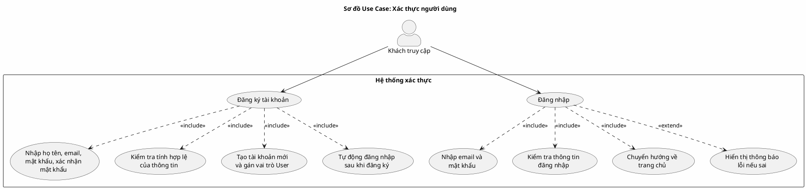

**Mô tả nghiệp vụ — Đăng ký tài khoản:**

1. Khách truy cập mở trang đăng ký.
2. Khách nhập họ tên đầy đủ, địa chỉ email, mật khẩu (tối thiểu 6 ký tự), và xác nhận mật khẩu.
3. Hệ thống kiểm tra: email có đúng định dạng không, mật khẩu có đủ độ dài không, xác nhận mật khẩu có trùng khớp không, email đã tồn tại trong hệ thống chưa.
4. Nếu hợp lệ, hệ thống tạo tài khoản mới, gán vai trò "User", và tự động đăng nhập.
5. Nếu không hợp lệ, hệ thống hiển thị thông báo lỗi cụ thể.

**Mô tả nghiệp vụ — Đăng nhập:**

1. Khách truy cập mở trang đăng nhập.
2. Khách nhập email và mật khẩu, có thể chọn "Ghi nhớ đăng nhập".
3. Hệ thống kiểm tra thông tin đăng nhập.
4. Nếu đúng, hệ thống tạo phiên đăng nhập và chuyển hướng về trang chủ.
5. Nếu sai, hệ thống hiển thị thông báo "Email hoặc mật khẩu không chính xác".

### 2.4.2 Use Case — Nghe nhạc và Tương tác bài hát

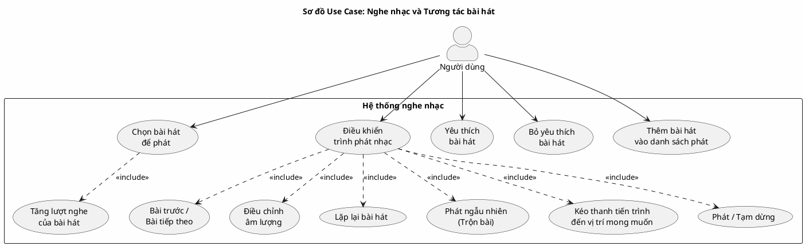

**Mô tả nghiệp vụ — Nghe nhạc:**

1. Người dùng duyệt bài hát ở bất kỳ trang nào (trang chủ, tìm kiếm, chi tiết nghệ sĩ, chi tiết album, danh sách phát).
2. Người dùng bấm vào bài hát, trình phát nhạc ở thanh cuối trang bắt đầu phát.
3. Trình phát hiển thị: ảnh bìa bài hát, tên bài hát, tên nghệ sĩ, thanh tiến trình, thời gian hiện tại/tổng thời gian.
4. Người dùng có thể: phát/tạm dừng, chuyển bài trước/tiếp, bật lặp lại, bật trộn bài, kéo thanh tiến trình, điều chỉnh âm lượng.
5. Hệ thống tự động tăng lượt nghe khi bài hát được phát.

**Mô tả nghiệp vụ — Yêu thích bài hát:**

1. Người dùng bấm nút trái tim bên cạnh bài hát.
2. Nếu chưa yêu thích, hệ thống thêm bài hát vào danh sách yêu thích, nút trái tim chuyển sang trạng thái đã chọn.
3. Nếu đã yêu thích, hệ thống xóa bài hát khỏi danh sách yêu thích, nút trái tim trở về trạng thái mặc định.

### 2.4.3 Use Case — Quản lý danh sách phát

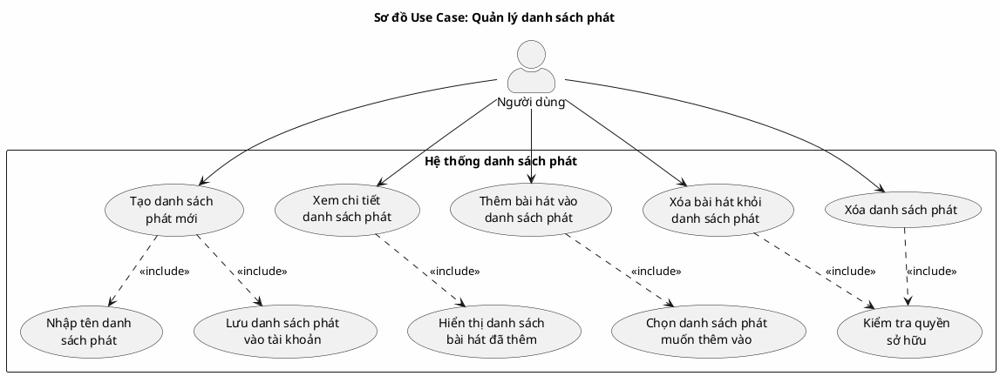

**Mô tả nghiệp vụ — Tạo danh sách phát:**

1. Người dùng bấm nút "+" trên thanh bên (sidebar) hoặc trong trang thư viện.
2. Hộp thoại (modal) hiện ra, người dùng nhập tên danh sách phát.
3. Bấm "Tạo", hệ thống lưu danh sách phát mới gắn với tài khoản người dùng hiện tại.
4. Danh sách phát mới xuất hiện ngay trên thanh bên.

**Mô tả nghiệp vụ — Thêm bài hát vào danh sách phát:**

1. Tại bất kỳ trang nào hiển thị bài hát, người dùng bấm nút menu (ba chấm) bên cạnh bài hát.
2. Danh sách các playlist của người dùng hiện ra.
3. Người dùng chọn playlist muốn thêm vào.
4. Hệ thống kiểm tra quyền sở hữu và thêm bài hát vào playlist.

### 2.4.4 Use Case — Theo dõi nghệ sĩ và Duyệt nội dung

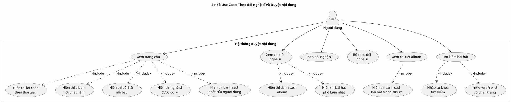

### 2.4.5 Use Case — Quản trị hệ thống (Admin)

```plantuml
@startuml
skinparam actorStyle awesome
skinparam backgroundColor #FEFEFE
skinparam shadowing false

title Sơ đồ Use Case: Quản trị hệ thống

actor "Quản trị viên" as Admin

rectangle "Trang quản trị (Admin Panel)" {
  rectangle "Quản lý bài hát" {
    usecase "Xem danh sách\nbài hát" as UC1
    usecase "Tìm kiếm, lọc,\nsắp xếp bài hát" as UC1_1
    usecase "Tải lên bài hát mới" as UC2
    usecase "Nhập thông tin\nbài hát" as UC2_1
    usecase "Tải lên file\nMP3" as UC2_2
    usecase "Tải lên ảnh bìa" as UC2_3
    usecase "Kiểm tra định dạng\nvà kích thước file" as UC2_4
    usecase "Chỉnh sửa\nbài hát" as UC3
    usecase "Thay thế file\nâm thanh mới" as UC3_1
    usecase "Thay thế ảnh\nbìa mới" as UC3_2
    usecase "Xóa bài hát" as UC4
    usecase "Xóa file âm thanh\nvà ảnh bìa" as UC4_1
  }

  rectangle "Quản lý nghệ sĩ" {
    usecase "Xem danh sách\nnghệ sĩ" as UC5
    usecase "Thêm nghệ sĩ mới" as UC6
    usecase "Chỉnh sửa\nnghệ sĩ" as UC7
    usecase "Xóa nghệ sĩ" as UC8
  }

  rectangle "Quản lý album" {
    usecase "Xem danh sách\nalbum" as UC9
    usecase "Thêm album mới" as UC10
    usecase "Chỉnh sửa album" as UC11
    usecase "Xóa album" as UC12
  }
}

Admin --> UC1
Admin --> UC2
Admin --> UC3
Admin --> UC4
Admin --> UC5
Admin --> UC6
Admin --> UC7
Admin --> UC8
Admin --> UC9
Admin --> UC10
Admin --> UC11
Admin --> UC12

UC1 ..> UC1_1 : <<include>>

UC2 ..> UC2_1 : <<include>>
UC2 ..> UC2_2 : <<include>>
UC2 ..> UC2_3 : <<extend>>
UC2 ..> UC2_4 : <<include>>

UC3 ..> UC3_1 : <<extend>>
UC3 ..> UC3_2 : <<extend>>

UC4 ..> UC4_1 : <<include>>

@enduml
```

**Mô tả nghiệp vụ — Tải lên bài hát mới:**

1. Quản trị viên truy cập trang quản trị, chọn mục "Quản lý bài hát".
2. Bấm nút "Tải lên bài hát mới".
3. Nhập thông tin bài hát: tên bài hát, chọn nghệ sĩ từ danh sách, chọn album (tùy chọn), nhập thể loại.
4. Tải lên file âm thanh định dạng MP3 (bắt buộc, tối đa 50MB).
5. Tải lên ảnh bìa (tùy chọn, định dạng JPG/JPEG/PNG/WEBP, tối đa 5MB).
6. Hệ thống kiểm tra định dạng và kích thước file.
7. Nếu hợp lệ, hệ thống lưu file vào thư mục uploads trên máy chủ, lưu thông tin bài hát vào cơ sở dữ liệu.
8. Hiển thị thông báo "Tải lên bài hát thành công!" và chuyển hướng về danh sách.

**Mô tả nghiệp vụ — Xóa bài hát:**

1. Quản trị viên bấm nút "Xóa" bên cạnh bài hát trong danh sách.
2. Hệ thống xóa file âm thanh và ảnh bìa (nếu có) trên máy chủ.
3. Xóa bản ghi bài hát khỏi cơ sở dữ liệu (cascade xóa các bản ghi PlaylistTracks, LikedTracks liên quan).
4. Hiển thị thông báo "Xóa bài hát thành công!".

## 2.5 Kiến trúc hệ thống

### 2.5.1 Sơ đồ kiến trúc tổng thể

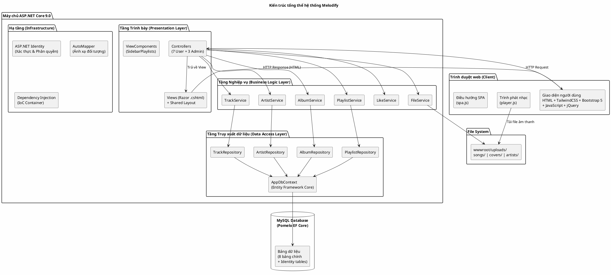

### 2.5.2 Mô tả kiến trúc

Hệ thống Melodify được thiết kế theo kiến trúc phân tầng (Layered Architecture) với 4 tầng chính:

**Tầng 1 — Tầng Trình bày (Presentation Layer):**
- **Controllers**: 7 Controller cho phân hệ người dùng (AccountController, HomeController, SearchController, LibraryController, PlaylistController, ArtistController, AlbumController) và 3 Controller cho phân hệ quản trị (TracksController, ArtistsController, AlbumsController).
- **Views**: Sử dụng Razor View Engine (.cshtml) với Shared Layout (thanh bên, thanh header, trình phát nhạc). Phân hệ quản trị có Layout riêng trong Area Admin.
- **ViewComponents**: SidebarPlaylistsViewComponent hiển thị danh sách playlist trên thanh bên.

**Tầng 2 — Tầng Nghiệp vụ (Business Logic Layer):**
- 6 Service class chứa toàn bộ logic nghiệp vụ, tách biệt khỏi Controller.
- Sử dụng AutoMapper để chuyển đổi giữa Entity và DTO.
- Xử lý phân trang, tìm kiếm, lọc, sắp xếp dữ liệu.

**Tầng 3 — Tầng Truy xuất dữ liệu (Data Access Layer):**
- 4 Repository class thực hiện truy vấn cơ sở dữ liệu thông qua Entity Framework Core.
- AppDbContext kế thừa IdentityDbContext, quản lý kết nối và ánh xạ ORM.

**Tầng 4 — Hạ tầng (Infrastructure):**
- ASP.NET Identity xử lý xác thực và phân quyền.
- Dependency Injection Container quản lý vòng đời các service.
- File System lưu trữ file media (âm thanh, ảnh bìa).

### 2.5.3 Bảng công nghệ sử dụng

| Thành phần | Công nghệ | Phiên bản |
|-----------|-----------|-----------|
| Framework | ASP.NET Core | 9.0 |
| Ngôn ngữ | C# | 13.0 |
| ORM | Entity Framework Core | 9.0.0 |
| Database Provider | Pomelo.EntityFrameworkCore.MySql | 9.0.0 |
| Cơ sở dữ liệu | MySQL | 5.5+ |
| Xác thực | ASP.NET Identity | 9.0.0 |
| Ánh xạ đối tượng | AutoMapper | 12.0.1 |
| CSS Framework | TailwindCSS (CDN) | 3.x |
| UI Components | Bootstrap | 5.3.0 |
| Icons | Bootstrap Icons | 1.10.5 |
| Font chữ | Plus Jakarta Sans | (Google Fonts) |
| JavaScript Library | jQuery | 3.6.0 |
| Runtime | .NET | 9.0 |

### 2.5.4 Sơ đồ tuần tự — Luồng đăng nhập

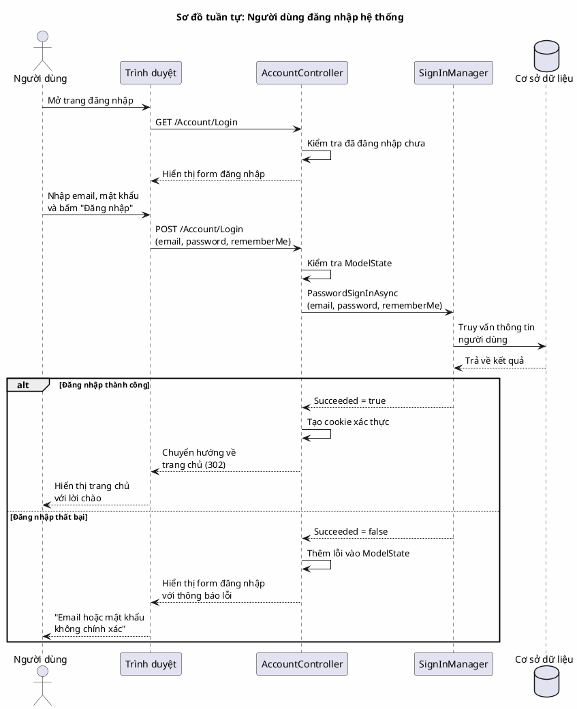

### 2.5.5 Sơ đồ tuần tự — Luồng nghe nhạc

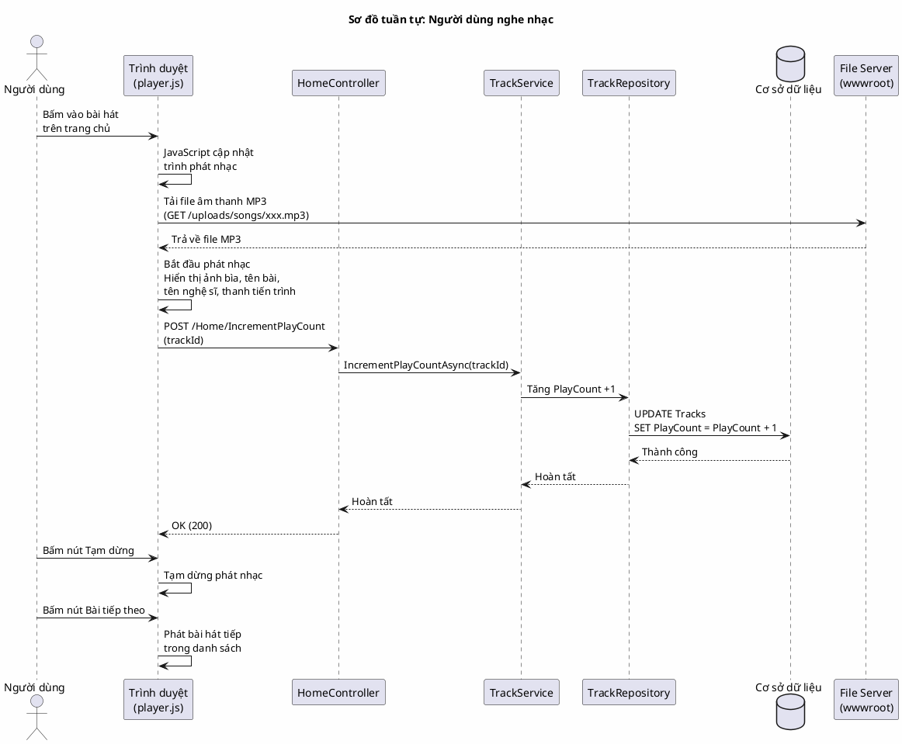

### 2.5.6 Sơ đồ tuần tự — Luồng tải lên bài hát (Admin)

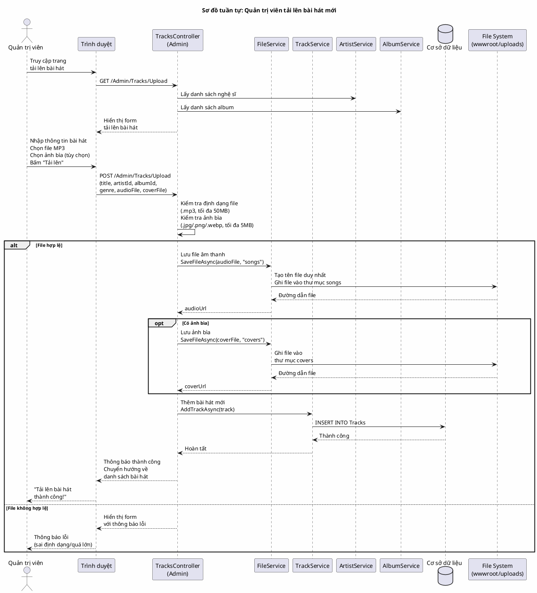

### 2.5.7 Sơ đồ hoạt động — Luồng tạo và quản lý danh sách phát

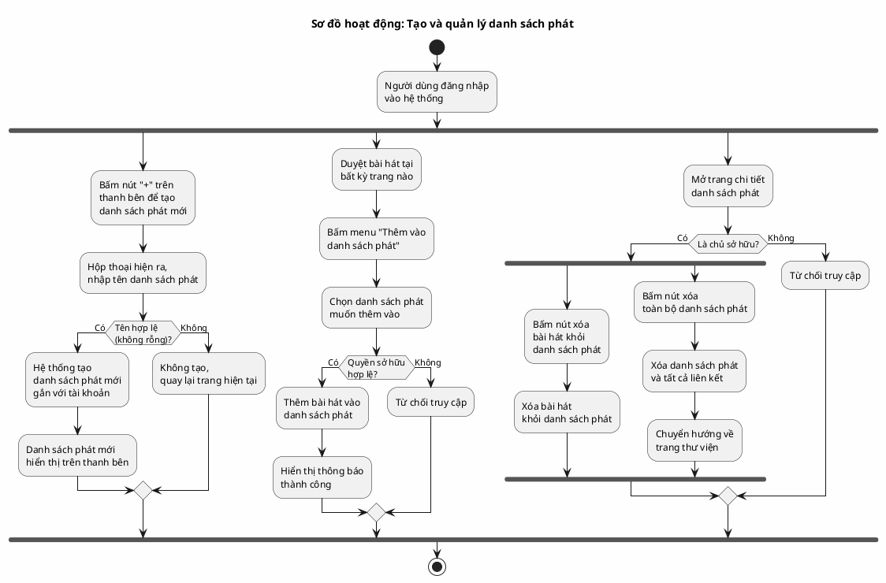

---

<!-- ══════════════════════════════════════════
     TRANG 4 — CHƯƠNG 3: KẾT QUẢ NGHIÊN CỨU
     - Tiêu đề: căn giữa, HOA, đậm — Heading 1
     - Đoạn mô tả: indent đầu dòng ~1.27 cm, căn justify
     - Ảnh minh hoạ: full width, với caption
     ══════════════════════════════════════════ -->

# CHƯƠNG 3: KẾT QUẢ NGHIÊN CỨU

<!-- Đoạn mô tả, indent đầu dòng ~1.27 cm, căn justify -->
Chương này trình bày các kết quả đạt được sau quá trình phân tích, thiết kế và cài đặt hệ thống website nghe nhạc trực tuyến Melodify. Các kết quả được trình bày theo từng chức năng, kèm theo hình ảnh minh họa giao diện thực tế.

<!-- Ghi chú: Chụp kết quả full màn hình, mô tả kết quả từng chức năng -->

## 3.1 Giao diện đăng nhập và đăng ký

**Trang đăng nhập** cho phép người dùng nhập email và mật khẩu để truy cập hệ thống. Giao diện sử dụng layout riêng (`_LoginLayout.cshtml`) với phong cách dark mode, form đăng nhập được căn giữa trang. Hỗ trợ tùy chọn "Ghi nhớ đăng nhập" và liên kết đến trang đăng ký cho người dùng chưa có tài khoản.

*Chụp full màn hình giao diện trang đăng nhập*

**Trang đăng ký** cho phép người dùng mới tạo tài khoản bằng cách nhập họ tên, email, mật khẩu và xác nhận mật khẩu. Hệ thống kiểm tra tính hợp lệ của dữ liệu đầu vào và hiển thị thông báo lỗi nếu có.

*Chụp full màn hình giao diện trang đăng ký*

## 3.2 Giao diện trang chủ

Trang chủ hiển thị sau khi đăng nhập thành công, bao gồm:
- **Lời chào động**: Thay đổi theo thời gian trong ngày ("Chào buổi sáng/chiều/tối, [Tên người dùng]").
- **Album mới phát hành**: Hiển thị 6 album mới nhất dưới dạng thẻ (card) với ảnh bìa.
- **Bài hát nổi bật**: Hiển thị 5 bài hát được đề xuất, cho phép phát nhạc trực tiếp.
- **Nghệ sĩ được gợi ý**: Hiển thị 5 nghệ sĩ với ảnh đại diện dạng tròn.
- **Danh sách phát của tôi**: Hiển thị tối đa 5 playlist gần đây của người dùng.

Giao diện sử dụng layout 3 phần: thanh bên trái (sidebar) hiển thị menu điều hướng và danh sách playlist, phần nội dung chính ở giữa, và trình phát nhạc cố định ở cuối trang.

*Chụp full màn hình giao diện trang chủ*

## 3.3 Giao diện trình phát nhạc

Trình phát nhạc được tích hợp cố định ở cuối trang, hiển thị trên tất cả các trang khi đã đăng nhập. Trình phát bao gồm:
- **Phần thông tin bài hát** (bên trái): Ảnh bìa nhỏ, tên bài hát, tên nghệ sĩ.
- **Phần điều khiển** (ở giữa): Nút phát/tạm dừng, bài trước, bài tiếp, lặp lại, trộn bài, thanh tiến trình kèm thời gian hiện tại/tổng thời gian.
- **Phần âm lượng** (bên phải): Thanh điều chỉnh âm lượng.

*Chụp full màn hình giao diện trình phát nhạc đang phát bài hát*

## 3.4 Giao diện tìm kiếm

Trang tìm kiếm cho phép người dùng nhập từ khóa vào ô tìm kiếm trên thanh header. Kết quả hiển thị dạng danh sách với thông tin: tên bài hát, tên nghệ sĩ, thời lượng, nút yêu thích, nút thêm vào playlist. Hỗ trợ phân trang với 20 kết quả mỗi trang.

*Chụp full màn hình giao diện tìm kiếm với kết quả*

## 3.5 Giao diện thư viện cá nhân

Trang thư viện hiển thị hai tab:
- **Tab "Danh sách phát"**: Hiển thị tất cả playlist của người dùng, cho phép tạo playlist mới.
- **Tab "Bài hát đã thích"**: Hiển thị tất cả bài hát đã đánh dấu yêu thích.

*Chụp full màn hình giao diện thư viện — Tab Danh sách phát*

*Chụp full màn hình giao diện thư viện — Tab Bài hát đã thích*

## 3.6 Giao diện chi tiết danh sách phát

Trang chi tiết playlist hiển thị tên playlist, danh sách bài hát đã thêm vào (tên bài, nghệ sĩ, thời lượng), cho phép phát nhạc, xóa bài hát khỏi playlist, hoặc xóa toàn bộ playlist.

*Chụp full màn hình giao diện chi tiết danh sách phát*

## 3.7 Giao diện chi tiết nghệ sĩ

Trang chi tiết nghệ sĩ hiển thị:
- Thông tin nghệ sĩ: tên, ảnh đại diện, số lượt nghe hàng tháng, tiểu sử.
- Nút theo dõi/bỏ theo dõi.
- 5 bài hát phổ biến nhất (sắp xếp theo lượt nghe giảm dần).
- Danh sách album của nghệ sĩ.

*Chụp full màn hình giao diện chi tiết nghệ sĩ*

## 3.8 Giao diện chi tiết album

Trang chi tiết album hiển thị thông tin album (tên, ảnh bìa, tên nghệ sĩ, năm phát hành) và danh sách tất cả bài hát trong album, cho phép phát nhạc, yêu thích, thêm vào playlist.

*Chụp full màn hình giao diện chi tiết album*

## 3.9 Giao diện trang quản trị

### 3.9.1 Quản lý bài hát

Trang quản lý bài hát hiển thị danh sách bài hát dạng bảng với các cột: STT, ảnh bìa, tên bài hát, nghệ sĩ, album, thể loại, lượt nghe, hành động (sửa/xóa). Hỗ trợ tìm kiếm theo tên, lọc theo nghệ sĩ, sắp xếp theo lượt nghe hoặc tên, phân trang 10 bài/trang.

*Chụp full màn hình giao diện quản lý bài hát*

### 3.9.2 Tải lên bài hát mới

Form tải lên bài hát bao gồm các trường: tên bài hát, chọn nghệ sĩ, chọn album, thể loại, file âm thanh MP3, ảnh bìa. Hệ thống kiểm tra định dạng và kích thước file trước khi lưu.

*Chụp full màn hình giao diện tải lên bài hát*

### 3.9.3 Quản lý nghệ sĩ

Trang quản lý nghệ sĩ hiển thị danh sách nghệ sĩ dạng bảng, hỗ trợ tìm kiếm và phân trang. Cho phép thêm mới, chỉnh sửa, xóa nghệ sĩ.

*Chụp full màn hình giao diện quản lý nghệ sĩ*

### 3.9.4 Quản lý album

Trang quản lý album hiển thị danh sách album dạng bảng, hỗ trợ tìm kiếm và phân trang. Cho phép thêm mới, chỉnh sửa, xóa album.

*Chụp full màn hình giao diện quản lý album*

---

<!-- ══════════════════════════════════════════
     TRANG 5 — CHƯƠNG 4: KẾT LUẬN VÀ HƯỚNG PHÁT TRIỂN
     - Tiêu đề: căn giữa, HOA, đậm — Heading 1
     - "Kết luận:" và "Hướng phát triển:": căn justify, indent đầu dòng ~1.27 cm
     ══════════════════════════════════════════ -->

# CHƯƠNG 4: KẾT LUẬN VÀ HƯỚNG PHÁT TRIỂN

**Kết luận:**

Sau quá trình nghiên cứu và phát triển, đồ án đã hoàn thành xây dựng hệ thống website nghe nhạc trực tuyến Melodify với các kết quả đạt được:

- Xây dựng thành công hệ thống website nghe nhạc trực tuyến hoàn chỉnh trên nền tảng ASP.NET Core 9.0, theo mô hình kiến trúc MVC với cấu trúc rõ ràng, phân tầng (Presentation → Business Logic → Data Access).
- Hiện thực đầy đủ 16 chức năng cho phân hệ người dùng: đăng ký, đăng nhập, đăng xuất, xem trang chủ, nghe nhạc, tìm kiếm, quản lý thư viện, tạo/sửa/xóa playlist, yêu thích bài hát, theo dõi nghệ sĩ, xem chi tiết nghệ sĩ/album/playlist.
- Hiện thực đầy đủ 12 chức năng cho phân hệ quản trị: quản lý CRUD bài hát, nghệ sĩ, album với tải lên file media, phân trang, tìm kiếm, lọc, sắp xếp.
- Thiết kế cơ sở dữ liệu quan hệ hợp lý với 8 bảng chính, sử dụng Entity Framework Core (Code-First) và MySQL.
- Áp dụng thành công các design pattern: Repository Pattern, Service Layer Pattern, Dependency Injection, giúp mã nguồn có tính module hóa cao, dễ bảo trì và mở rộng.
- Thiết kế giao diện hiện đại, thân thiện theo phong cách dark mode, responsive trên nhiều kích thước màn hình.
- Hệ thống xác thực và phân quyền hoạt động ổn định với ASP.NET Identity (vai trò User/Admin).

**Hướng phát triển:**

- Tích hợp API nhạc bên ngoài (Spotify API, YouTube Music API) để mở rộng kho nhạc.
- Phát triển tính năng đề xuất nhạc thông minh dựa trên lịch sử nghe và sở thích người dùng (Recommendation System).
- Xây dựng tính năng xếp hàng phát nhạc (Queue) và lịch sử phát.
- Phát triển ứng dụng di động (mobile app) sử dụng React Native hoặc Flutter.
- Tích hợp thanh toán để hỗ trợ mô hình gói đăng ký Premium (subscription).
- Thêm tính năng lời bài hát (lyrics) hiển thị đồng bộ theo thời gian.
- Phát triển tính năng mạng xã hội: chia sẻ playlist, theo dõi bạn bè, bình luận bài hát.
- Tối ưu hiệu suất: sử dụng Redis cache, CDN cho file media, lazy loading.
- Triển khai hệ thống trên cloud (Azure, AWS) với CI/CD pipeline.

---

<!-- ══════════════════════════════════════════
     TRANG 6 — DANH MỤC TÀI LIỆU THAM KHẢO
     - Tiêu đề: căn giữa, HOA, đậm — không phải Heading số (unnumbered)
     - Ghi chú: căn trái, không đậm
     ══════════════════════════════════════════ -->

## DANH MỤC TÀI LIỆU THAM KHẢO

[1] Microsoft, "ASP.NET Core documentation," Microsoft Learn, 2024. [Online]. Available: https://learn.microsoft.com/en-us/aspnet/core/

[2] Microsoft, "Entity Framework Core documentation," Microsoft Learn, 2024. [Online]. Available: https://learn.microsoft.com/en-us/ef/core/

[3] Microsoft, "ASP.NET Core Identity documentation," Microsoft Learn, 2024. [Online]. Available: https://learn.microsoft.com/en-us/aspnet/core/security/authentication/identity

[4] Pomelo Foundation, "Pomelo.EntityFrameworkCore.MySql – MySQL & MariaDB provider for Entity Framework Core," GitHub, 2024. [Online]. Available: https://github.com/PomeloFoundation/Pomelo.EntityFrameworkCore.MySql

[5] AutoMapper Contributors, "AutoMapper documentation," 2024. [Online]. Available: https://docs.automapper.org/

[6] Adam Wathan, "TailwindCSS documentation," 2024. [Online]. Available: https://tailwindcss.com/docs

[7] Bootstrap Team, "Bootstrap 5 documentation," 2024. [Online]. Available: https://getbootstrap.com/docs/5.3/

[8] Martin Fowler, "Patterns of Enterprise Application Architecture," Addison-Wesley, 2002.

[9] Robert C. Martin, "Clean Architecture: A Craftsman's Guide to Software Structure and Design," Prentice Hall, 2017.

[10] Jon P. Smith, "Entity Framework Core in Action," Manning Publications, 2nd Edition, 2021.
